The following is an article I wrote in September 2010 for an online magazine while I was spending time with my family back in my home country. Sadly for me, the article didn't get picked up for publication and, so, it remained in the proverbial drawer until August 2020 when I came across [Sean Carrol](https://www.preposterousuniverse.com)'s excellent video series [The Biggest Ideas in the Universe](https://www.youtube.com/playlist?list=PLrxfgDEc2NxZJcWcrxH3jyjUUrJlnoyzX).

Sean covers much of what I talk about in this article (and much more!) in the series' 17th episode, on [Matter](https://www.youtube.com/watch?v=dQWn9NzvX4s). Watching that episode, I thought it would be cool to resurrect the article since it goes through some material that Sean did not cover and it has some extra (and really cool) demonstrations of what this article and Sean's video are all about.

You may notice that I refer to myself as *Roklimber* in the article's byline and in the videos. That was the handle I used back when I was a very active member of that online magazine's community. I've since moved on to other endeavours and no longer use that handle very much anymore.

---

## Topology, Particle Physics, and party tricks to blow your mind's socks off

What happens when you spin around a full 360 degrees? Other than getting dizzy, nothing much else happens, right? Well, contrary to common experience and to what you learned in elementary school, a 360-degree rotation is not always the same as not doing any rotations at all.

In this two-part article you'll find out why that is and you'll also learn how it profoundly affects the physics of elementary particles, the stuff the universe is made of. Along the way, I'll describe some really awesome little demonstrations that you can actually try for yourself or do in parties, things that will literally blow your mind.

by **Wagner Truppel** ( aka *Roklimber* )

--

### Rotations, rotations, rotations...

We all know that a 360-degree rotation is like doing no rotation at all, right? Well, actually, not quite.

Yeap, it turns out that a 360-degree rotation is not equivalent to doing no rotations. Even weirder is that **two** full rotations (a rotation by 720 degrees) ***are*** equivalent to doing no rotations at all.

"Liar!", you say.

No, no, I'm serious. It turns out that any **even** number of full rotations (2, 4, 6, etc rotations of 360 degrees each) are equivalent to not doing any rotations at all, while any **odd** number of rotations (1, 3, 5, etc rotations of 360 degrees each) are equivalent to a **single** 360-degree rotation.

Hard to believe? Then watch the YouTube video below, of me contorting myself to rotate a mug (the left image is a link to the movie).

[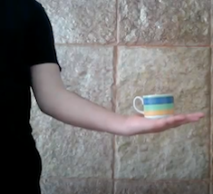](https://www.youtube.com/watch?v=aTJXxVkpzAw)
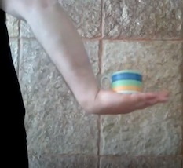

Note that, even though the mug looks exactly like it did before I performed the 360-degree rotation, its relation to the rest of the world is different from that before the rotation. It's only when I perform a second 360-degree rotation in the same direction that I restore the mug's "connections" to the world around it to what they were before I performed any rotations at all.

Cool, eh?

Strange as this is, you might think that it's not such a big deal. It turns out, though, that this little fact is behind some of the most profound properties of the physical world. No, I'm not exaggerating. This is behind something truly profound in Physics and, remarkably, you don't need to be a physicist to understand or appreciate it.

And that's what I want to show you. But, first, I need to talk a little bit about **Topology**.

--

### Part I: Topology

We've all learned something about **Geometry** in school. Geometry is the part of Mathematics that deals with so-called metric properties, things like size, length, distance, angles, areas, and volumes. However, objects of interest to mathematicians and physicists have other, more fundamental, properties. The best way to explain what these so-called **topological properties** are is by means of examples.

Consider a handle-less cup and a sphere, like a rubber ball.

Would you say that these objects are equivalent in some way? No? Well, it turns out that, from the perspective of their topological properties, they are actually identical. Here's why.

You can press on the top of the rubber ball and squeeze it to form a "dip", which you can then make deeper and deeper until the ball resembles the cup. At no time you ruptured the material of which the ball is made, you never tore any pieces, and you never glued new pieces to it. All you did was a continuous deformation of the ball by stretching or compressing it in different places.

Those operations - stretching and compressing, without tearing or glueing - are the only allowed operations in the world of topological properties (besides more trivial ones, like translations and rotations). Any time you can transform one object into another by means of those operations, you will have shown that those objects are *topologically equivalent*.

Let me give you another example. Consider now a cup with a handle, like a mug:

Is that equivalent to a ball?

No, because no matter how much you deform, stretch or compress the mug, you will never be able to get rid of the hole formed by the handle. The only way to get rid of that hole would be to cut the handle or to glue its side to the side of the mug, and those two operations are not allowed in the topological game.

You can also see that they're not topologically equivalent by working with the ball. How can you make a hole without tearing through the material of the ball? You can't!

Ok, so a mug isn't topologically equivalent to a ball. Boohoo. 

However, it *is* topologically equivalent to a doughnut, which perhaps explains why it's such a natural thing for people to eat doughnuts while drinking coffee. 😜

Can you see why the mug and the doughnut are topologically equivalent? You can deform the body of the mug, compressing it, to become part of the ring that forms the handle and then you're left with a handle with a hole in the middle. That's your doughnut right there. You can also stretch a piece of the doughnut and shape it into the body of the mug. If that's difficult to imagine, then this animation will probably help:

[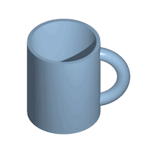](https://upload.wikimedia.org/wikipedia/commons/2/26/Mug_and_Torus_morph.gif)

Now, you know those metal puzzles that you find in game stores, where you have to "free" some piece of metal from some other complicated piece of metal? (The images below are linked to YouTube videos)

[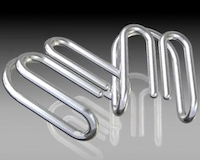](https://www.youtube.com/watch?v=_hGo7Pg5HTs)

Those puzzles work because of topology. It turns out that the piece you need to free is already free, from a topological point of view. All you need to do is perform certain operations - rotations and translations - that are even simpler than stretching and compressing.

But... why am I talking about topology anyway?

Because, as it happens, space itself (and spacetime, too) has some topological properties and those are responsible for the fact that a 360-degree rotation is not always equivalent to a non-rotation.

Allow me to elaborate by means of examples.

Imagine a one-dimensional world, a world where there is no up, down, left or right, but only forward and backward. If you happened to be stuck in traffic on your way to work, in that world, then you're really stuck. It doesn't matter how big or small your one-dimensional car is. You can't "get around" the car in front of you, nor go above it. See, metric properties like size don't help here. You're really stuck because of the topological properties of a one-dimensional world.

On the other hand, if you lived in a two-dimensional world, like that of our city streets, then there is a way out of a traffic jam: just take the first road you can that diverts you from the jam and "go around" it. Again, that's possible because a 2-dimensional world is topologically different from a 1-dimensional world.

Incidentally, as pointed out by Stephen Hawking in his book *A Brief History Of Time*, 2-dimensional beings could not have a digestive system with distinct entry and exit points. Why? Because if they did, their bodies would be separated in two parts! That's another indication that spaces of different numbers of dimensions are topologically distinct from one another.

So, anyway, the point of all this talk about topology is to give you some sort of justification, without getting into the detailed math, of two facts:

- an **even** number of full rotations are equivalent to **zero** rotations,
- an **odd** number of full rotations are equivalent to a **single** full rotation.

You might not be convinced just yet, so I'll end the first part of this essay with a demonstration that ought to convince you, and also clearly show why topology is the reason behind.

Imagine that you have a small rectangular board (say, made from thick cardboard), with three holes in it. To each hole you attach an elastic cord or something similar and you also attach the other end of each cord to a fixed place, like a wall or a desk.

The idea is to untangle the cords after rotating the board a certain number of times. You're allowed to move the board around, but you're not allowed to rotate it after you've done the initial rotation. You are also allowed to stretch the cords, but you're not allowed to cut them. More details in the YouTube video below.

[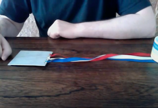](https://www.youtube.com/watch?v=ycLHgsaXT3s)

After untangling one of the cords, it's easy to notice the crucial fact that one of the other cords is stuck in the hole formed by the other two cords and their surrounding materials. This is like the doughnut and the sphere. There's no way to get rid of the hole, to free the cord that's piercing through it, unless you cut some cord, which you're not allowed to do. So, a single full rotation puts the board-and-cords contraption into a state that is topologically different from the state it was before you rotated the board. Therefore, a single full rotation is not equivalent to no rotation. You can watch a video of me demonstrating this by clicking on the image just above.

But the cool part is the next one where, by fully rotating the board *twice*, it becomes possible to untangle the cords. As before, the image is linked to a YouTube video.

[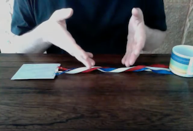](https://www.youtube.com/watch?v=obwwMw9qkq4)

It's bizarre, isn't it? It looks like you have to make a bigger mess, to make things worse, to entangle the cords more, in order to be able to disentangle them at all!

In the next part of this article, I'll show you what all of this has to do with physics and I'll show you some more awesomely bizarre demos, including an extension of the board-and-cords contraption that will make you doubt your sanity (or mine!).

--

### Part II: Physics

In part I of this article, I tried to convince you that an even number of full rotations (rotations by 360 degrees) are equivalent to no rotation, while an odd number of full rotations are equivalent to a single full rotation.

This is at odds (!) with our common experience that a full rotation looks indistinguishable from no rotation. The key reason for that fact is that our everyday perception does not take into account the relation that objects have with each other when they rotate. This is of special importance to the physics of elementary particles, as I'll show you in this part of the article.

So, we'll now talk about Physics. If you have an interest in Physics in general, or Particle Physics and Quantum Mechanics in particular, then keep reading.

The main object of interest in Particle Physics is what we call elementary particles, the blobs of stuff that make the matter we find in the universe. There is a whole zoo of particles, each of which with its own antiparticle, and things can get really complicated so all these particles are classified into groups, depending on certain properties.

I already mentioned one kind of classification: **particles** versus **antiparticles**.

There is no earth-shattering distinction between them. In fact, what we call a particle, aliens might call an antiparticle, and vice-versa. This has some interesting consequences if you want to shake hands with them. What if an alien tells you that he's made of matter when, in fact, what he calls matter is what we call antimatter? Then, as you shake hands, you annihilate one another in a huge explosion! 💥

It turns out, however, that it is possible to ascertain for a fact whether or not what he calls matter is also what we call matter, and it's possible to do so by exchanging nothing but information in the form of light. I won't get into that here, though, because I don't want to get sidetracked. Maybe I'll write another article just about that.

Another useful classification is in terms of the interactions that particles respond to. **Hadrons** respond to the *strong nuclear force*, **Leptons** do not. Hadrons are further divided into **Baryons** and **Mesons**.

Baryons have 3 quarks, Mesons have a pair quark-antiquark. Leptons are believed to be elementary, that is, they're not made of something else. Some particles are carriers of the interactions and so are not classified as either Hadrons or Leptons. By the way, now you know what the word Hadron in [**Large Hadron Collider**](https://home.cern/science/accelerators/large-hadron-collider) (LHC) means.

[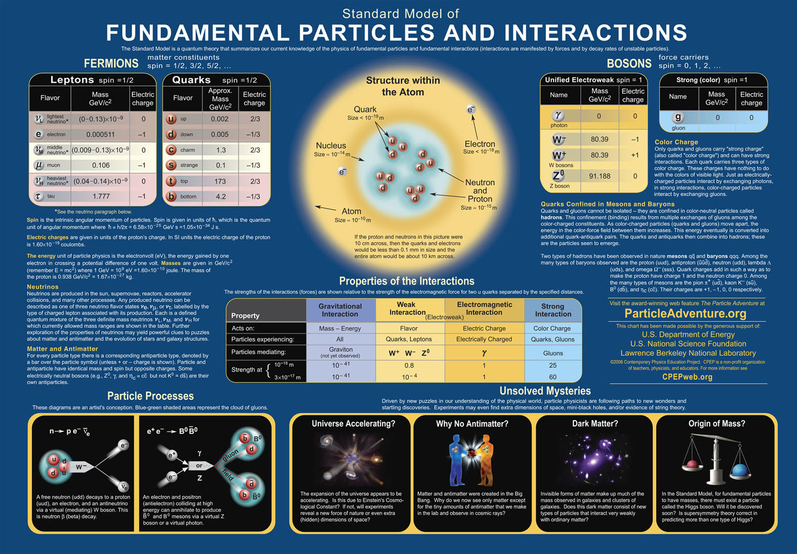](https://www.cpepweb.org/images/chart_2006_4.jpg)

Yet another classification is in terms of the particle's **spin**. Spin is a quantum-mechanical property that has to do with how particles behave under rotations, so we'll be talking a lot about spin in what follows below. Particles with **integer** spin (0, 1, 2, 3, etc) are called **Bosons**, particles with **half-integer** spin (1/2, 3/2, 5/2, etc) are called **Fermions**.

Now, it just so happens that Bosons and Fermions have another property, a mysterious and amazing one: *identical Bosons like to stick together*, so to speak. They like to stay in the **same** quantum state. *Identical Fermions*, on the other hand, *not only **don't** like to stay in the same quantum state but*, in fact, ***cannot** do so*.

This so-called statistical property of Bosons and Fermions was a big mystery for a long time. In particular, the connection between spin and statistics (identical particles with half-integer spin can't be in the same quantum state; identical particles with integer spin love to stay in the same quantum state) can be derived from fundamental ideas but the proof is very very complicated.

Is it possible to understand this connection without having to do the math? Yes, and that's what I'll show you today. And it all has to do with rotations and the topology stuff I discussed in the first part of this article.

You should take a moment to appreciate how cool this is. The spin-statistics theorem is one of the most fundamental results in all of *Quantum Field Theory*, and one of the most complicated to prove. Yet, it can be understood conceptually, with not much math at all.

Ok, so now that we know where we're heading, let's get started.

#### Spin

What's spin? That is a very complicated question to answer, so I'll just say that it's a property that particles have which characterizes their behavior under rotations.

Say what?

Think of spin like the board-and-cords contraption of part I of this article. Spin is a property of a particle that tells the particle whether it's been fully-rotated an odd number of times or an even number of times.

How exactly?

Ok, well, hopefully you know that in Quantum Mechanics, things are described by so-called wave functions. Now, it turns out that the wave function for a particle of integer spin (a Boson) does not change sign when you rotate the particle by a full 360 degrees, nor by any number of such rotations.

On the other hand, the wave function for particles with half-integer spin (Fermions) do change sign when you rotate them by a full 360 degrees, or by any odd number of such rotations.

I can't explain that without math, because it is a mathematical result in its very essence, so you'll just have to believe me on this one. However, you can see (or at least believe) that this is so because of the topological properties of 3-dimensional space.

In a sense, spin is how the difference between even and odd numbers of full rotations, which we discussed in part I, expresses itself in the world of particle physics. Particles with integer spin are not sensitive to that difference (even vs. odd number of 360-degree rotations), while particles with half-integer spin are: their wave functions change sign under an odd number of 360-degree rotations but not under an even number of such rotations. More on this a little further down.

#### The PEP

Why is it that electrons don't rush towards the nucleus of the atom they're a part of? After all, they're being attracted by the positive charge of the nucleus. What makes some electrons be close to the nucleus and some be farther out?

These were big questions back in the early days of Quantum Mechanics and it was [Wolfgang Pauli](https://en.wikipedia.org/wiki/Wolfgang_Pauli) who offered a successful explanation, known as the **Pauli Exclusion Principle**, or **PEP**. He suggested that electrons must populate atoms in a certain fashion, in *shells* or *levels*, because electrons can't stay in the same quantum state. Back then, no one knew the spin-statistics theorem so this was a property that they believed only electrons had. It was only later that folks realized that all Fermions behave that way, not just electrons.

But why? Why can't electrons (or, more generally, identical Fermions) be in the same quantum state? What happens if they try?

Imagine that you have two electrons, one in state 1 and the other in state 2. Now, electrons are identical to one another, so how do you really know which electron is in which state? You don't, and that's why you have to consider both possibilities. That's a law in Quantum Mechanics. If you can't tell two possibilities apart, then they both contribute to whatever it is that you're computing.

So, pretend that one electron is called ***A**lice* and the other is called ***B**ob*. The wave function of these two electrons is the sum

where FA(1) is the wave function of electron Alice when it's in state 1, FB(2) is the wave function of electron Bob when it's in state 2, and so on for the other two Fs.

Note that the first product has electron Alice in state 1 and electron Bob in state 2 whereas the second product has Bob in state 1 and Alice in state 2, that is, the two electrons are exchanged between the two states.

Now, if electrons cannot be in the same state, say, state 1, then it must be the case that the total wave function is zero when you force state 2 to be the same as state 1:

or

In other words, when you exchange the two electrons *in the* ***same*** *state*, a minus sign should appear.

Now, this isn't an explanation. It's merely a suggestion, a suggestion that the PEP can be explained if we can show that exchanging two identical Fermions causes a minus sign to pop up in the wave function.

But... wait. Isn't that what happens when we fully-rotate Fermions? Yes! So, maybe, just maybe, there is a way to connect the behavior of Fermions under rotation with their behavior under an exchange.

Some folks reading this might be pretty confused right about now. So, let me summarize all of this and then show you some demos to clarify this whole thing.

    - What we know:

        We know that particles of half-integer spin (Fermions) induce a sign
        change in their wave functions when they're rotated by (an odd multiple
        of) 360 degrees. This is due to the topological properties of
        3-dimensional space.

    - What we're trying to understand:

        - Why, when we exchange two identical particles of half-integer
          spin, their combined wave function also changes sign.

        - Why identical particles of half-integer spin cannot be in the
          same quantums state, that is, the PEP.

    - What we suspect the connection is:

        If we can show that an exchange implies a rotation of 360 degrees
        then we can understand both of those facts.

Ok, so how do we go about showing that an exchange implies a rotation of 360 degrees? I'll show you that in two ways, using demos.

First, grab two identical large coins and fix one down on the table. Use a bit of glue to keep it from moving. Next, rotate the other one around the first one, without slipping.

Note that you start with the fixed coin at the bottom and the movable coin at the top. When their positions are exchanged - the moving coin is at the bottom - note that it has rotated around itself by a full 360 degrees already! This is counter-intuitive. When asked, most people will say that the moving coin will have rotated only once when it gets back to the top, rather than twice. Incidentally, this is a great way to make money in bar bets.

You can also use something else, rather than coins, as I've done in the movie below. Notice how, again, one ball has been rotated by 360 degrees around itself when its position is exchanged with that of the other ball, and you need to make two such rotations to restore the original arrangement.

[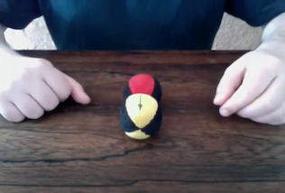](https://www.youtube.com/watch?v=TUkd7-B60wQ)

Here's another way to show the same thing. Cut a long strip of paper and draw a line extending all the way on one side of the strip, so you can easily tell one side from the other. Alternatively, you can use paper whose sides are of different colors.

Hold each end of the strip with one hand, making sure that the strip isn't twisted. The top sides of the two ends should belong to the same side of the strip.

Now exchange the two ends by moving your hands around. Note how exchanging the ends causes the strip to be twisted.

Here's the crucial part: that twist is removed when a rotation of 360 degrees is applied to one of the ends, as I show in the movie below.

[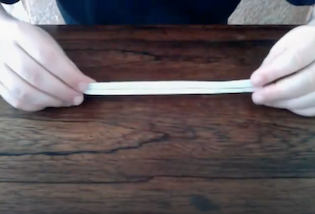](https://www.youtube.com/watch?v=4F687S7SFYI)

So, we now see that exchanging two identical objects is exactly equivalent to rotating one of them by 360 degrees. And that has nothing to do with Quantum Mechanics. In fact, it's just a result of the topology of 3-dimensional space.

If those two objects are identical Fermions, then we know that that rotation causes a minus sign to appear in their combined wave function. Therefore, we have shown that an exchange of two identical Fermions also changes the sign of their wave function. As a result, if they're in the same state, the wave function has to be equal to minus itself, which means it has to vanish, which means that we can't have those two Fermions in the same state, and we have explained the PEP!

If, on the other hand, those two objects are identical Bosons, then we know that the corresponding rotation will not change their combined wave function so exchanging two identical Bosons doesn't change the sign of their combined wave function. In other words, Bosons (identical or otherwise) are not affected by the PEP.

We have also understood the spin-statistics connection because we've shown that an exchange of identical particles (the statistics part) is equivalent to a single 360-degree rotation (which relates to the spin part).

This is all great but why is this of any importance?

- Because, without the PEP, electrons would collapse into the nucleus and all atoms would look exactly the same, meaning that chemistry would be really really boring, and life wouldn't be possible.

- Because, without the PEP, stars would collapse into black holes right away, skipping intermediate steps. With the PEP, you have things like neutron stars, where the relentless pull of gravity compresses nuclei together in such a way that protons capture electrons, turning into neutrons. Since neutrons are Fermions, they can't be squeezed into the same quantum state and the resulting pressure to stay in different quantum states balances gravity, at least for a while. When the gravitational pull is so intense that even neutron stars must collapse, they might turn into more exotic forms like a star made of identical quarks (this is still hypothetical). Quarks are also Fermions and so the PEP applies to them as well. And when gravity is too strong even for the PEP pressure, the star collapses into a black hole.

- Because the fact that identical Bosons love to stick together in the same quantum state is the reason why **lasers** exist. Photons have spin 1, so they're Bosons, and they love to be in the same state, when given that chance. That's why laser light is so "pure" (the technical word is **coherent**) - all the photons are doing exactly the same thing.

- Likewise, **superconductivity** happens because pairs of electrons conspire to produce a quasi-particle - called a *Cooper Pair* - which behaves like a Boson. Cooper pairs love to stick together in the same state, a state where, effectively, there are no collisions with the atoms of the material they're in and, hence, no electric resistance. This, in turn, can be used, among other things, to create magnetic levitation, as illustrated in the movie below.

    [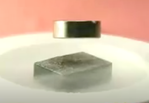](https://www.youtube.com/watch?v=0IkiEQTpqgU)
    
    Since I originally wrote this article (2010), a much cooler demonstration of magnetic levitation has been made. The TED talk below is from 2012:
    
    [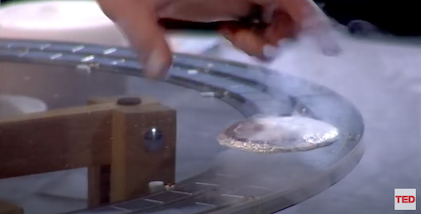](https://www.youtube.com/watch?v=PXHczjOg06w)

- **Superfluidity** is the same story. Helium 3 is a bosonic atom so, below a certain critical temperature, all Helium 3 atoms stick to the same quantum state which causes the fluid to be free of internal friction. Superfluids have some bizarre behaviors, as shown in the video below.

    [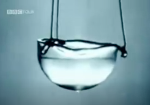](https://www.youtube.com/watch?v=2Z6UJbwxBZI)
    
    Since the entire sample of Helium 3 is in one single quantum state, its wave function extends to a large volume of space, surrounding the entire sample. As a result, the top part of the sample "senses" the bottom part and because they want to be together, the top part actually fights gravity to go uphill and drip towards the bottom part. That's a gigantic oversimplification, of course. A more accurate explanation is to say that it is energetically more favorable for both parts of the sample to be together than for them to be apart, despite the gravitational energy barrier separating them.

#### A twisted end

And now, what I've promised earlier: something that will make you doubt your sanity. Remember the board-and-cords contraption? How about a more complicated version of that? Check out this sequence of pictures, from one of my favorite books.

|             |             |             |
| ----------- | ----------- | ----------- |
| 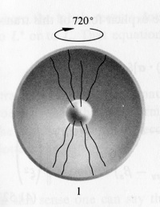 | 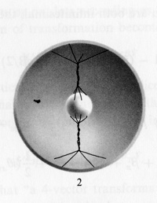 | 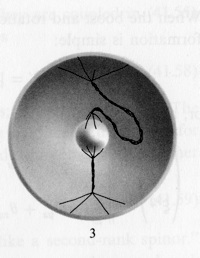 |
| 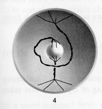 | 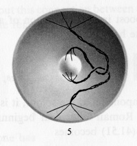 | 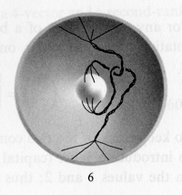 |
| 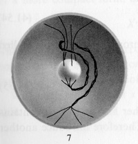 | 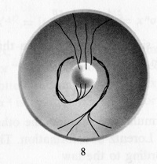 | 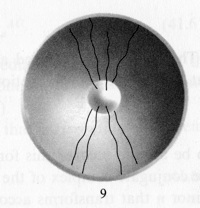 |

These are from Chapter 42 of *Gravitation* by Wheeler, Thorne, and Misner. I actually built it when I was in my first year in graduate school, a few decades ago, though I used two hollow cubes inside one another.

#### Sources

- The contortion rotate-the-mug feat was first shown, if I'm not mistaken, by [Richard Feynman](https://en.wikipedia.org/wiki/Richard_Feynman). I recently discovered that it's also known as ["the plate trick"](http://en.wikipedia.org/wiki/Plate_trick).

- [*A Brief History Of Time*](http://www.amazon.com/Brief-History-Time-Stephen-Hawking/dp/0553380168/), by [Stephen Hawking](https://en.wikipedia.org/wiki/Stephen_Hawking).

- I do not recall where I learned about the board-and-cords contraption. It might have been from a book or a column written by the late [Martin Gardner](https://en.wikipedia.org/wiki/Martin_Gardner), but that's just a guess.

- The two-coin demonstration is from a book by [Seymour Papert](https://en.wikipedia.org/wiki/Seymour_Papert) on a subject that has *absolutely nothing* to do with the topic of this article: [*Mindstorms: Children, Computers, And Powerful Ideas*](http://www.amazon.com/Mindstorms-Children-Computers-Powerful-Ideas/dp/0465046746). It just so happens that it fits the needs of this article so I used that here, though I replaced the coins with juggling balls. To my knowledge, the idea of using it for this purpose originated with me.

- The argument that an exchange implies a 360-degree rotation, and the second demonstration I used above to show it, with the paper strip, were discovered/invented by Richard Feynman and appear in the excellent (but non-trivial) book [*Elementary Particles and The Laws of Physics: The 1986 Dirac Memorial Lectures*](http://www.amazon.com/Elementary-Particles-Laws-Physics-Memorial/dp/0521658624/) by Feynman and [Steven Weinberg](https://en.wikipedia.org/wiki/Steven_Weinberg).

- The 3-dimensional version of the board-and-cords contraption is from Chapter 42 of [*Gravitation*](http://www.amazon.com/Gravitation-Physics-Charles-W-Misner/dp/0716703440) by Wheeler, Thorne, and Misner.

[^image_sources]: Image sources:

    Glass cup: https://upload.wikimedia.org/wikipedia/commons/f/ff/Glass_cup.JPG
    
    Rubber balls: http://www.fravend.eu/PAGES/Images/BB5-rubber-ball-in-opp-bag,.jpg
    
    Wikipedia mug: https://upload.wikimedia.org/wikipedia/commons/a/ae/Wikipedia_mug.jpg
    
    Mug morphing into a torus: https://upload.wikimedia.org/wikipedia/commons/2/26/Mug_and_Torus_morph.gif
    
    Particle physics chart: http://www.cpepweb.org/images/chart_2006_4.jpg
